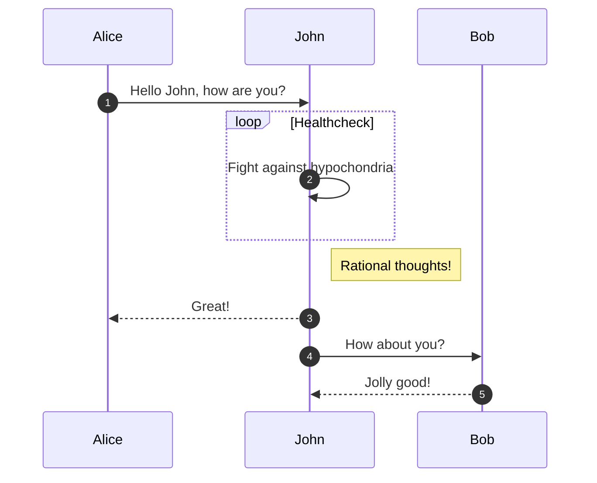

# Docker and K8S

[](https://pkg.go.dev/github.com/ranjith-ka/Devops)

Golang, Docker and Kube Practise session

Kubernetes 1.6+

## Quotes to spice my work

“Innovation is taking two things that already exist and putting them together in a new way.”
- Tom Freston

“What's measured improves”
― Peter Drucker

 “It's not about your resources, it's about your resourcefulness .”
 - Tony Robbins

<https://en.wikipedia.org/wiki/Peter_Drucker>

Red Green Refactor
<https://quii.gitbook.io/learn-go-with-tests/>

Learn -> adapt -> document -> share


# Docker Desktop alternate

<https://github.com/abiosoft/colima>

```bash
## colima start --arch x86_64 --vm-type=qemu --cpu 8 --memory 16 --disk 100 --kubernetes
# To start colima with Kubernetes with x86_64 architecture
colima start
docker build . && docker ps -a 
colima stop
```

## Helm

```bash
brew install helm
```

## Automated PR

```bash
brew install github/gh/gh
git add .
git commit -am "just testing"
gh pr create -f
```

## Go WorkSpace

Go1.18 feature of Go Workspace is enabled here.

```bash
cd ~/code/Devops
cd ..
go work init ./Devops (Note go.wrk file will be created, and ENV variable was assinged)
go work sync
```

## Create Nginx Service

```bash
helm repo add ingress-nginx https://kubernetes.github.io/ingress-nginx
helm repo update
```

<https://github.com/kubernetes/ingress-nginx/tree/master/charts/ingress-nginx>

```bash
helm install -f minikube/nginx/values.yaml nginx ingress-nginx/ingress-nginx
```

```bash
$ minikube service ingress-nginx-controller  --url
http://192.168.99.100:32080
http://192.168.99.100:31443
http://192.168.99.100:32443
```

Add awesome-http.example.com in /etc/hosts to connect local

```bash
curl http://awesome-http.example.com/dev
curl http://awesome-http.example.com/dev/metrics
```

## Kind environment

Install colima from pervious steps, to run Kind we need docker engine is running.

`colima start`

Testing in kind cluster, port mapping required for docker image of Kube worker node. So please make sure extraport mappings are added in the kind/config.yaml
Remember to add in /etc/hosts (to nginx to work)

Follow the document

<https://github.com/ranjith-ka/Devops/tree/master/kind#kubernetes-in-docker-kind>

```bash
CONTAINER ID        IMAGE                   COMMAND                  CREATED             STATUS              PORTS                       NAMES
89c1110261bb        kindest/node:v1.16.15   "/usr/local/bin/entr…"   13 minutes ago      Up 13 minutes       127.0.0.1:65273->6443/tcp   openfaas-control-plane
84a1f8bc9b54        kindest/node:v1.16.15   "/usr/local/bin/entr…"   13 minutes ago      Up 13 minutes       0.0.0.0:32080->32080/tcp    openfaas-worker
```

```bash
$ helm install -f minikube/dev/canary.yaml canary-dev charts/dev
$ helm install -f minikube/dev/prd.yaml prd-dev charts/dev

$ curl -s -H "testing: always" http://awesome-http.example.com/dev
Welcome to my canary website!%

$ curl -s -H "testing: never" http://awesome-http.example.com/dev
Welcome to my prod website!%
```

## Install Cobra

### Dadjoke CLI Tool

-   Text tutorial: <https://divrhino.com/articles/build-command-line-tool-go-cobra>
-   Video tutorial: <https://www.youtube.com/watch?v=-tO7zSv80UY>

Just trying out the tutorial

```bash
cobra init --pkg-name github.com/ranjith-ka/Devops
go mod init github.com/ranjith-ka/Devops
```

Add new command

```bash
cobra add random
```

Used below to convert JSON To go Struct online.

<https://mholt.github.io/json-to-go/>

Added the Pluing REST Client for postman things.

ctrl + alt + M -- Stop the running code.

### Go Learning

<https://github.com/StephenGrider/GoCasts>

### YAML remove comments

Remove all comments <https://marketplace.visualstudio.com/items?itemName=plibither8.remove-comments>


## Mongo

To run mongo in local MAC, run the Make commands, this will be helpful for local testing.
`make run-mongo`

Clean the logs, kill the process if not required.

### GIT FLOW

I created GIT FLOW using the same nvie git flow, but added two release to understand better.




### Operators

<https://developers.redhat.com/author/deepak-sharma>


## Application Usage Guide

This document provides instructions on how to use the application.

## Prerequisites

1. Ensure you have Visual Studio Code installed.
2. Install the Copilot Chat extension from the VS Code marketplace.
3. Set up your development environment as per the project requirements.

## Steps to Use the Application

1. Clone the repository:
   ```bash
   git clone <repository-url>
   cd <repository-folder>
   ```

2. Start the application:
   ```bash
   go run main.go serve
   ```

3. Open your browser and navigate to `http://localhost:8080` to access the application.

4. Available endpoints:
   - `/`: Welcome message.
   - `/hello`: Displays the first HTTP program message.
   - `/hello2`: Displays the second HTTP program message.
   - `/headers`: Displays the request headers.
   - `/joke`: Fetches a random joke.

5. Open Visual Studio Code and navigate to the Copilot Chat panel.

6. Follow the instructions in the [Readme](../Readme.md) to configure custom instructions.

## Troubleshooting

- If you encounter issues, check the logs or refer to the FAQ section in this document.
- For further assistance, contact the support team.


### Skaffold

```bash
   kubectl create secret generic kaniko-secret \
   --from-file=.dockerconfigjson=$HOME/.docker/config.json \
   --type=kubernetes.io/dockerconfigjson
```
