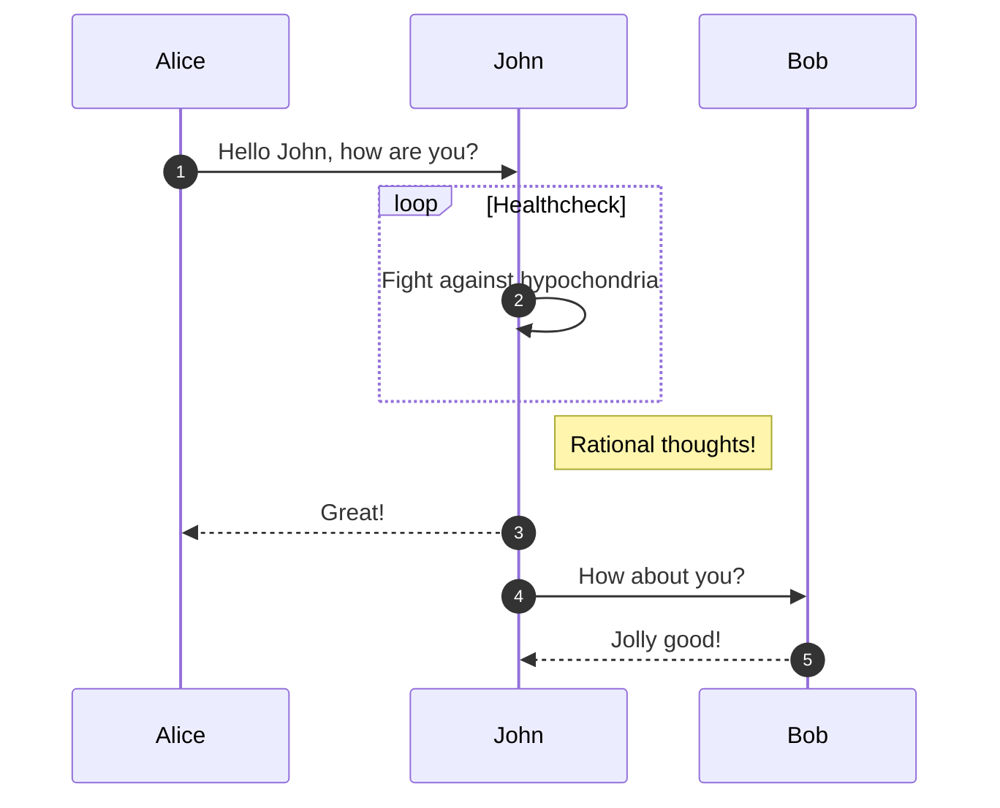

# AI Platform Engineering Leadership Roadmap

My long-term career goal is to evolve from DevOps and platform engineering into an AI Platform Engineering / AI Infrastructure leadership role similar to organizations like Adobe Express, OpenAI, Anthropic, or Microsoft AI.

This roadmap focuses on:

- AI platform engineering
- LLM orchestration
- AI infrastructure
- AI developer enablement
- AI governance
- AI adoption at scale
- Engineering leadership

---

# Target Role

## Areas of Responsibility

- Lead and grow engineering teams
- Drive AI platform architecture
- Build scalable AI systems
- Enable AI adoption across organizations
- Design AI infrastructure and runtime platforms
- Partner with product, research, and engineering teams
- Build production-ready LLM applications
- Improve developer productivity using AI
- Create governance and evaluation standards

---

# 1. LLM Engineering

## Topics to Learn

- Prompt engineering
- Tool calling
- RAG architectures
- AI agents
- Context engineering
- Memory systems
- Multi-agent orchestration
- AI evaluation frameworks
- Model routing
- Cost optimization

## Resources

- OpenAI Cookbook  
  https://cookbook.openai.com/

- Anthropic Engineering Blog  
  https://www.anthropic.com/engineering

- LangChain Docs  
  https://python.langchain.com/docs/introduction/

- LangGraph Docs  
  https://langchain-ai.github.io/langgraph/

- LlamaIndex Docs  
  https://docs.llamaindex.ai/

- Microsoft AI Agents for Beginners  
  https://github.com/microsoft/ai-agents-for-beginners

- Prompt Engineering Guide  
  https://www.promptingguide.ai/

---

# 2. Agentic AI Systems

## Topics to Learn

- Single-agent systems
- Multi-agent systems
- Agent orchestration
- Planning and reasoning
- Tool routing
- Memory management
- Retry and fallback systems
- MCP (Model Context Protocol)

## Resources

- CrewAI Docs  
  https://docs.crewai.com/

- AutoGen Docs  
  https://microsoft.github.io/autogen/stable/

- Semantic Kernel  
  https://learn.microsoft.com/en-us/semantic-kernel/overview/

- OpenAI Agents SDK  
  https://openai.github.io/openai-agents-python/

- Ultimate LLM Agent Build Guide  
  https://www.vellum.ai/blog/the-ultimate-llm-agent-build-guide

---

# 3. RAG & AI Search Systems

## Topics to Learn

- Embeddings
- Chunking strategies
- Vector databases
- Hybrid search
- Re-ranking
- Retrieval pipelines
- Evaluation strategies

## Resources

- RAGAS Paper  
  https://arxiv.org/abs/2309.15217

- NVIDIA RAG Course  
  https://courses.nvidia.com/courses/course-v1:DLI+S-FX-15+V1/

- Pinecone Learn  
  https://www.pinecone.io/learn/

- Weaviate Academy  
  https://academy.weaviate.io/

- Qdrant Documentation  
  https://qdrant.tech/documentation/

---

# 4. AI Evaluation & Observability

## Topics to Learn

- Hallucination detection
- Prompt versioning
- Regression testing
- AI tracing
- Latency tracking
- Cost monitoring
- Safety evaluation
- LLM benchmarking

## Resources

- LangSmith  
  https://docs.smith.langchain.com/

- Langfuse  
  https://langfuse.com/docs

- Weights & Biases Weave  
  https://weave-docs.wandb.ai/

- Maxim AI Blog  
  https://www.getmaxim.ai/articles/8-best-prompt-engineering-tools-for-ai-teams-in-2025/

---

# 5. AI Infrastructure & Platform Engineering

## Topics to Learn

- GPU orchestration
- AI workload scheduling
- Distributed inference
- AI API gateways
- Model serving
- AI runtime platforms
- Kubernetes for AI
- Inference optimization

## Resources

- KServe  
  https://kserve.github.io/website/

- vLLM  
  https://docs.vllm.ai/

- Ray Serve  
  https://docs.ray.io/en/latest/serve/index.html

- NVIDIA Triton  
  https://developer.nvidia.com/triton-inference-server

- Kubeflow  
  https://www.kubeflow.org/

- BentoML  
  https://docs.bentoml.com/

---

# 6. AI Leadership & Governance

## Topics to Learn

- AI governance
- Organizational AI adoption
- Secure AI systems
- AI rollout strategies
- AI compliance
- AI developer enablement
- AI success metrics

## Resources

- Microsoft AI Architecture Center  
  https://learn.microsoft.com/en-us/azure/architecture/ai-ml/

- AWS Generative AI  
  https://aws.amazon.com/generative-ai/

- Google Research Publications  
  https://research.google/pubs/

---

# 7. Books to Read

## Recommended Books

- Designing Data-Intensive Applications
- Building Machine Learning Powered Applications
- AI Engineering
- The LLM Engineering Handbook

---

# 8. Portfolio Projects

## 1. AI DevOps Assistant

An AI agent that:
- Reads Kubernetes incidents
- Analyzes logs
- Queries observability tools
- Suggests remediation
- Creates incident reports

---

## 2. Internal Enterprise RAG Platform

Features:
- Document ingestion
- Vector database
- Access control
- Evaluation pipelines
- Multi-model routing
- Tracing and observability

---

## 3. AI Testing Framework for Microservices

Features:
- Contract test generation
- AI-powered API validation
- Test failure summarization
- Pact integration
- Kafka event validation

---

## 4. Kubernetes AI Operator

Features:
- AI-driven autoscaling
- Cost optimization
- Intelligent remediation
- Runtime recommendations

---

# 9. My Technical Focus Areas

## Focus More On

- AI system design
- LLM orchestration
- AI runtime platforms
- Evaluation systems
- Context engineering
- AI governance
- AI adoption strategies
- Engineering leadership

## Focus Less On

- Pure infrastructure automation
- Traditional CI/CD-only workflows
- Operations-only responsibilities

---

# 10. Ideal Future Roles

- AI Platform Engineer
- AI Infrastructure Engineer
- AI Systems Architect
- AI Developer Experience Engineer
- AI Enablement Lead
- AI Runtime Platform Lead
- AI Engineering Manager
- AI Platform Engineering Leader

---

# Personal Positioning

My background in:
- Kubernetes
- DevOps
- Platform engineering
- Developer enablement
- Testing systems
- Architecture

creates a strong foundation for building scalable AI infrastructure and enabling AI adoption across engineering organizations.

The goal is to bridge:
- AI systems
- platform engineering
- developer productivity
- scalable infrastructure
- organizational AI transformation

into a leadership role focused on production-grade AI platforms.


---

# Docker, Kubernetes & Go — Hands-on Notes

[](https://pkg.go.dev/github.com/ranjith-ka/Devops)

Golang, Docker and Kube Practice session

Kubernetes 1.6+

## Quotes to spice my work

“Innovation is taking two things that already exist and putting them together in a new way.”
- Tom Freston

“What's measured improves”
― Peter Drucker

 “It's not about your resources, it's about your resourcefulness .”
 - Tony Robbins

"Upon a falling card, birds soar high;
Even paper learns to fly.
But when the card rests on the ground,
Only truth remains around."

- kalaignar
  
<https://en.wikipedia.org/wiki/Peter_Drucker>

Red Green Refactor
<https://quii.gitbook.io/learn-go-with-tests/>

Learn -> adapt -> document -> share


# Docker Desktop alternate

<https://github.com/abiosoft/colima>

```bash
## colima start --arch x86_64 --vm-type=qemu --cpu 8 --memory 16 --disk 100 --kubernetes
# To start colima with Kubernetes with x86_64 architecture
colima start
docker build . && docker ps -a 
colima stop
```

## Helm

```bash
brew install helm
```

## Automated PR

```bash
brew install github/gh/gh
git add .
git commit -am "just testing"
gh pr create -f
```

## Go WorkSpace

Go1.18 feature of Go Workspace is enabled here.

```bash
cd ~/code/Devops
cd ..
go work init ./Devops (Note go.wrk file will be created, and ENV variable was assigned)
go work sync
```

## Create Nginx Service

```bash
helm repo add ingress-nginx https://kubernetes.github.io/ingress-nginx
helm repo update
```

<https://github.com/kubernetes/ingress-nginx/tree/master/charts/ingress-nginx>

```bash
helm install -f minikube/nginx/values.yaml nginx ingress-nginx/ingress-nginx
```

```bash
$ minikube service ingress-nginx-controller  --url
http://192.168.99.100:32080
http://192.168.99.100:31443
http://192.168.99.100:32443
```

Add awesome-http.example.com in /etc/hosts to connect local

```bash
curl http://awesome-http.example.com/dev
curl http://awesome-http.example.com/dev/metrics
```

## Kind environment

Install colima from previous steps, to run Kind we need docker engine is running.

`colima start`

Testing in kind cluster, port mapping required for docker image of Kube worker node. So please make sure extra port mappings are added in the kind/config.yaml
Remember to add in /etc/hosts (to nginx to work)

Follow the document

<https://github.com/ranjith-ka/Devops/tree/master/kind#kubernetes-in-docker-kind>

```bash
CONTAINER ID        IMAGE                   COMMAND                  CREATED             STATUS              PORTS                       NAMES
89c1110261bb        kindest/node:v1.16.15   "/usr/local/bin/entr…"   13 minutes ago      Up 13 minutes       127.0.0.1:65273->6443/tcp   openfaas-control-plane
84a1f8bc9b54        kindest/node:v1.16.15   "/usr/local/bin/entr…"   13 minutes ago      Up 13 minutes       0.0.0.0:32080->32080/tcp    openfaas-worker
```

```bash
$ helm install -f minikube/dev/canary.yaml canary-dev charts/dev
$ helm install -f minikube/dev/prd.yaml prd-dev charts/dev

$ curl -s -H "testing: always" http://awesome-http.example.com/dev
Welcome to my canary website!%

$ curl -s -H "testing: never" http://awesome-http.example.com/dev
Welcome to my prod website!%
```

## Install Cobra

### Dadjoke CLI Tool

-   Text tutorial: <https://divrhino.com/articles/build-command-line-tool-go-cobra>
-   Video tutorial: <https://www.youtube.com/watch?v=-tO7zSv80UY>

Just trying out the tutorial

```bash
cobra init --pkg-name github.com/ranjith-ka/Devops
go mod init github.com/ranjith-ka/Devops
```

Add new command

```bash
cobra add random
```

Used below to convert JSON To go Struct online.

<https://mholt.github.io/json-to-go/>

Added the Plugin REST Client for postman things.

ctrl + alt + M -- Stop the running code.

### Go Learning

<https://github.com/StephenGrider/GoCasts>

### YAML remove comments

Remove all comments <https://marketplace.visualstudio.com/items?itemName=plibither8.remove-comments>


## Mongo

To run mongo in local MAC, run the Make commands, this will be helpful for local testing.
`make run-mongo`

Clean the logs, kill the process if not required.

### GIT FLOW

I created GIT FLOW using the same nvie git flow, but added two release to understand better.



```mermaid
sequenceDiagram
    autonumber
    Alice->>John: Hello John, how are you?
    loop Healthcheck
        John->>John: Fight against hypochondria
    end
    Note right of John: Rational thoughts!
    John-->>Alice: Great!
    John->>Bob: How about you?
    Bob-->>John: Jolly good!
```

### Operators

<https://developers.redhat.com/author/deepak-sharma>


## Application Usage Guide

This document provides instructions on how to use the application.

## Prerequisites

1. Ensure you have Visual Studio Code installed.
2. Install the Copilot Chat extension from the VS Code marketplace.
3. Set up your development environment as per the project requirements.

## Steps to Use the Application

1. Clone the repository:
   ```bash
   git clone <repository-url>
   cd <repository-folder>
   ```

2. Start the application:
   ```bash
   go run main.go serve
   ```

3. Open your browser and navigate to `http://localhost:8080` to access the application.

4. Available endpoints:
   - `/`: Welcome message.
   - `/hello`: Displays the first HTTP program message.
   - `/hello2`: Displays the second HTTP program message.
   - `/headers`: Displays the request headers.
   - `/joke`: Fetches a random joke.

5. Open Visual Studio Code and navigate to the Copilot Chat panel.

6. Follow the instructions in the [Readme](../Readme.md) to configure custom instructions.

## Troubleshooting

- If you encounter issues, check the logs or refer to the FAQ section in this document.
- For further assistance, contact the support team.

### Skaffold

```bash
   kubectl create secret generic kaniko-secret \
   --from-file=.dockerconfigjson=$HOME/.docker/config.json \
   --type=kubernetes.io/dockerconfigjson
```

```bash
## To activate the Profile with configs
skaffold dev -p prd

## Activate with module 
skaffold dev --module canary
```

