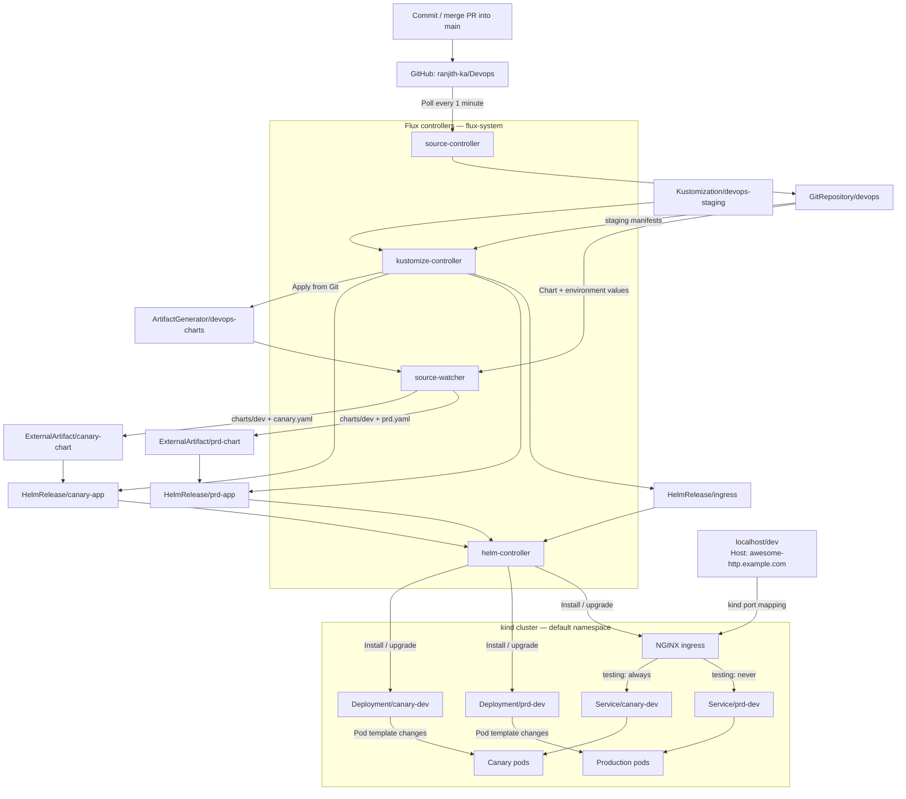

# Source-watcher with the existing Devops applications

## What this exercise teaches

Source-controller fetches the Git repository. Source-watcher watches its artifact,
extracts the shared Helm chart and merges the release-specific values. It publishes
`canary-chart` and `prd-chart` ExternalArtifacts. Helm-controller consumes those
artifacts through each HelmRelease's `spec.chartRef`.

The copies create a `dev/` chart directory with Chart.yaml, templates and merged
values.yaml. No chart version bump is needed to observe content changes through
ExternalArtifact revisions. All resources live in `default`; Flux controllers live
in `flux-system`.

References: [ArtifactGenerator](https://fluxcd.io/flux/components/source/artifactgenerators/),
[Helm chart references](https://fluxcd.io/flux/components/helm/helmreleases/#chart-reference).

## Architecture



A canary image version change updates the canary artifact, triggers its Helm
upgrade, and replaces canary pods when the pod template changes. Production's
artifact stays unchanged. Without the routing header, NGINX sends approximately
30% of requests to canary according to the configured weight.

The automatic staging-manifest path becomes active after merging this setup into
the watched branch and running `make flux-app` once.

## 1. Install and inspect

Follow the [lab README](../Readme.md) to run `make flux` and apply the staging
Kustomization. The Flux CLI must be v2.7.2 or later; use a current stable release
for the current Kubernetes cluster.

```bash
flux --version
flux check
kubectl -n flux-system get deployments
kubectl -n flux-system get deployment helm-controller \
  -o jsonpath='{.spec.template.spec.containers[0].args}'
```

Helm-controller must enable `ExternalArtifact`. The current Flux installation
includes `--feature-gates=ExternalArtifact=true`. If yours does not, enable it in
your managed controller configuration before using these HelmReleases.

## 2. Inspect the artifacts and releases

```bash
kubectl -n default get gitrepository devops
kubectl -n default get artifactgenerator devops-charts
kubectl -n default get externalartifacts
kubectl -n default get externalartifact canary-chart prd-chart \
  -o custom-columns=NAME:.metadata.name,REVISION:.status.artifact.revision
flux get helmreleases -n default
helm list -n default
```

The generated charts merge base values with the environment values in that order.
Canary image settings come from `minikube/dev/canary.yaml`; production image settings
come from `minikube/dev/prd.yaml`. Neither HelmRelease overrides the image settings.
Canary still has inline ingress, probe and metrics settings which take precedence
for those fields. Use `image.tag` or `replicaCount` for the automatic upgrade exercise.

To upgrade an image, set `image.tag` to an existing immutable tag in the appropriate
values file, commit and merge into the watched branch. Source-watcher generates a
new artifact, Helm-controller upgrades that release, and Kubernetes rolls out pods
if their template changes. Pushing a new image under an unchanged `latest` tag does
not change the Git content or trigger this flow.

## 3. Practise independent updates

Record both ExternalArtifact revisions using the command above. Add or change
`replicaCount: 2` in `minikube/dev/canary.yaml`. Commit and push that edit to the
branch watched by `GitRepository/devops`, then run:

```bash
flux reconcile source git devops -n default
kubectl -n default get externalartifact canary-chart prd-chart \
  -o custom-columns=NAME:.metadata.name,REVISION:.status.artifact.revision
flux get helmreleases -n default
kubectl -n default get deployments
```

Allow the controllers time to reconcile. The canary artifact revision should change;
the production artifact revision should stay the same. Production may still perform
its periodic reconciliation, but it should not upgrade because of this canary edit.

Repeat with `minikube/dev/prd.yaml`; only the production artifact should change.
Finally, make a meaningful shared chart change (for example a default value used by
both releases in `charts/dev/values.yaml`): both artifacts should change.
A documentation-only edit outside the copied chart and values files should change
neither generated artifact. Restore the exercise edits through Git when finished.

## 4. Troubleshoot each stage

```bash
kubectl -n default describe gitrepository devops
kubectl -n default describe artifactgenerator devops-charts
kubectl -n default describe externalartifact canary-chart
kubectl -n default describe helmrelease canary-app
kubectl -n flux-system logs deployment/source-watcher --tail=100
kubectl -n flux-system logs deployment/helm-controller --tail=100
```

- Source not ready: check URL, branch and credentials. The default source uses public HTTPS.
- Generator not ready: check the copied paths and the source's ignore rules. Both `charts/` and `minikube/` must be included.
- Release not ready: check the ExternalArtifact feature gate, generated chart and Helm events.
- Pods not ready: inspect their events for image pull failures or application errors.
  This lab still uses the existing `ranjithka` application images.
- HTTP routing problems: inspect the ingress release and ingress class. This exercise
  retains the existing ingress-nginx chart pin; it does not upgrade that separate dependency.

## Migrating an existing installation

The release names remain `canary-dev` and `prd-dev`, the chart name remains `dev`,
and the namespace remains `default`. Production retains its deployment toleration
using the current `postRenderers.kustomize.patches` format.

Switching from `spec.chart` to `spec.chartRef` performs a Helm upgrade and Flux
cleans up the old generated HelmChart. When applying to an existing HelmRelease,
confirm that `spec.chart` has been removed; the two fields cannot coexist. If another
manager created it, remove the old field in that manager's configuration before applying.

After merging this setup into the watched branch, run `make flux-app` once. It
bootstraps the source and `Kustomization/devops-staging`, which manages the staging
Flux resources from Git. Future staging manifest edits no longer require manual
kubectl apply. The sync manifest lives outside the managed staging directory.

```bash
flux reconcile kustomization devops-staging -n default --with-source
flux get kustomizations -n default
```

For this upgrade, removing the canary HelmRelease's inline image settings allows
the generated chart's environment values to control its image. Review the canary
values file before merging; it currently selects `latest` with `pullPolicy: Always`.
The chart's random `rollme` annotation also causes pod replacement on Helm upgrades
while Chart.yaml's `appVersion` is `latest`, even for changes unrelated to the image.
Notifications and image automation remain separate exercises.
