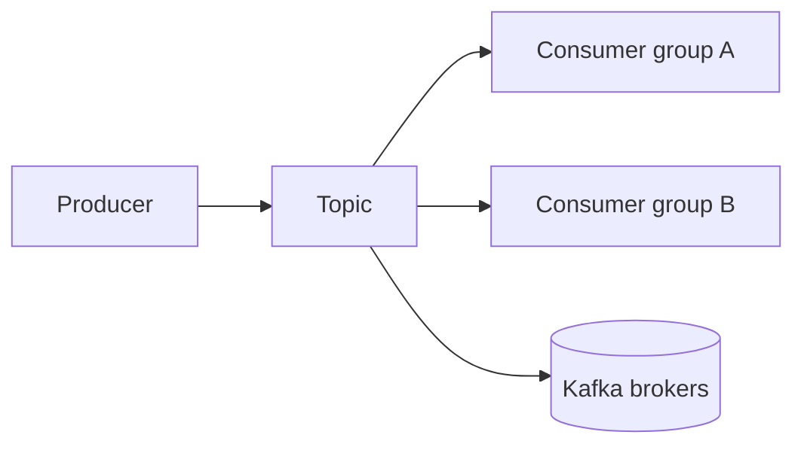

# Kafka Tutorial

This tutorial is aligned with the concepts covered in Confluent's Kafka 101 learning path and adapted to the Strimzi-based Kafka cluster in this repo.

Primary references:

- Kafka 101 playlist: https://www.youtube.com/playlist?list=PLa7VYi0yPIH0KbnJQcMv5N9iW8HkZHztH
- Kafka 101 course overview: https://developer.confluent.io/courses/apache-kafka/events/

## Chapter Map

**Chapter 1 (getting started):** [chapter_01_getting_started/README.md](chapter_01_getting_started/README.md) — Kafka fundamentals, producers, consumers, and Minikube setup.

**Chapter 2 (schema and event contracts):** [chapter_02_schema_registry/README.md](chapter_02_schema_registry/README.md) — Schema Registry concepts and a repo-oriented hands-on path.

**Chapter 3 (system integration):** [chapter_03_kafka_connect/README.md](chapter_03_kafka_connect/README.md) — Kafka Connect and how source/sink connectors fit into the platform.

**Chapter 4 (stream processing):** [chapter_04_stream_processing/README.md](chapter_04_stream_processing/README.md) — Stream processing basics and Flink SQL concepts from the course.

**Chapter 5 (confluent ecosystem):** [chapter_05_confluent_offerings/README.md](chapter_05_confluent_offerings/README.md) — A practical overview of the broader platform around Kafka.

## Kafka 101 Module Mapping

| Course module | Local chapter |
|---|---|
| Introduction | Chapter 1 |
| Topics | Chapter 1 |
| Partitions | Chapter 1 |
| Brokers | Chapter 1 |
| Replication | Chapter 1 |
| Producers | Chapter 1 |
| Hands-on Exercise: Kafka Producer | Chapter 1 |
| Consumers | Chapter 1 |
| Hands-on Exercise: Kafka Consumer | Chapter 1 |
| Confluent Schema Registry | Chapter 2 |
| Hands-on Exercise: Confluent Schema Registry | Chapter 2 |
| Kafka Connect | Chapter 3 |
| Hands-on Exercise: Kafka Connect | Chapter 3 |
| Stream Processing | Chapter 4 |
| Hands-on Exercise: Stream Processing With Flink SQL | Chapter 4 |
| Introduction to Confluent's Offerings | Chapter 5 |

