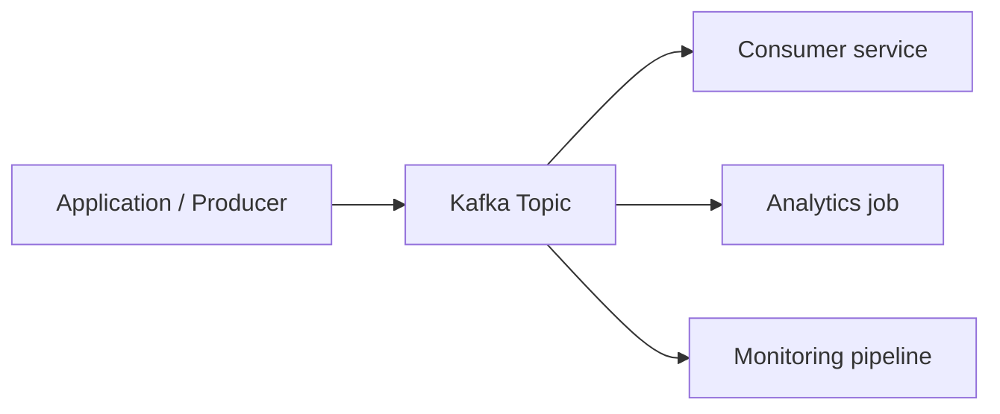

# 1.1 Introduction to Kafka

Reference: https://developer.confluent.io/courses/apache-kafka/events/

Kafka is a distributed event streaming platform. Instead of treating data only as rows in tables, Kafka treats data as **events** that happened at a specific time.

Examples of events:

- a user placed an order
- a payment was approved
- a sensor reported a temperature
- an application emitted an audit log

## Why Kafka is used

Kafka is commonly used for:

- decoupling microservices
- building real-time pipelines
- collecting logs and telemetry
- integrating databases and applications
- feeding stream-processing systems

## Core idea

Producers write events to Kafka. Kafka stores those events durably in topics. Consumers read those events independently at their own pace.

## Why this matters

The key advantage is that one event can be reused by multiple consumers without each system needing a direct point-to-point integration.

Prev: [README.md](README.md) · Next: [02_topics_partitions.md](02_topics_partitions.md)
