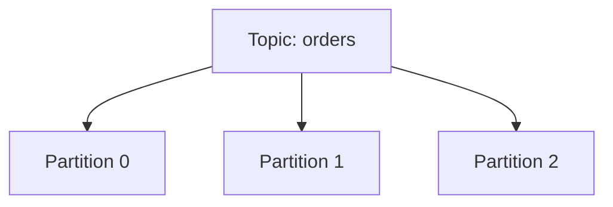

# 1.2 Topics and partitions

Reference: https://developer.confluent.io/courses/apache-kafka/events/

## Topic

A **topic** is a named stream of events. Applications usually publish related events into the same topic.

Examples:

- `orders`
- `payments`
- `user-signups`

## Partition

A topic is split into one or more **partitions**. Partitions are the unit of:

- storage
- ordering
- parallelism

Kafka guarantees ordering **within a partition**, not across the whole topic.

## Offset

Each record in a partition gets an **offset**, which is the record's position inside that partition.

| Partition | Offset sequence |
|-----------|-----------------|
| `orders-0` | `0, 1, 2, 3...` |
| `orders-1` | `0, 1, 2, 3...` |

Consumers use offsets to track what they have already read.

## Why partitions matter

- More partitions allow more consumers in a consumer group to work in parallel.
- The record key can be used to route related events to the same partition.
- If order matters for one entity, use a stable key such as `customerId` or `orderId`.

## In this repo

When you produce to topic `my-topic`, Kafka stores the records in that topic's partitions behind the bootstrap service `my-cluster-kafka-bootstrap:9092`.

Next: [03_brokers_replication.md](03_brokers_replication.md)
