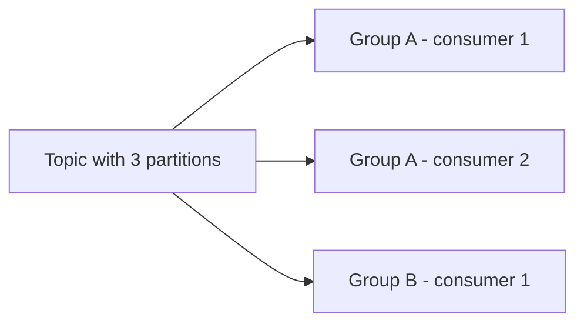

# 1.4 Producers and consumers

Reference: https://developer.confluent.io/courses/apache-kafka/events/

## Producer

A **producer** publishes records to a topic.

Producer concerns usually include:

- which topic to write to
- which key to use
- whether acknowledgements are required
- whether batching or compression is enabled

## Consumer

A **consumer** reads records from a topic.

Consumers track their current position using offsets. That allows them to:

- continue where they left off
- replay older messages
- start from the beginning when needed

## Consumer groups

Consumers can cooperate in a **consumer group**.

- Each partition is consumed by only one consumer in the same group.
- Different groups can read the same topic independently.



## Commands used in this repo

Producer:

```bash
kubectl -n kafka run kafka-producer -ti \
  --image=quay.io/strimzi/kafka:0.39.0-kafka-3.6.1 \
  --rm=true --restart=Never -- \
  bin/kafka-console-producer.sh \
  --bootstrap-server my-cluster-kafka-bootstrap:9092 \
  --topic my-topic
```

Consumer:

```bash
kubectl -n kafka run kafka-consumer -ti \
  --image=quay.io/strimzi/kafka:0.39.0-kafka-3.6.1 \
  --rm=true --restart=Never -- \
  bin/kafka-console-consumer.sh \
  --bootstrap-server my-cluster-kafka-bootstrap:9092 \
  --topic my-topic \
  --from-beginning
```

`--from-beginning` tells the console consumer to start at the earliest available offset.

Prev: [03_brokers_replication.md](03_brokers_replication.md) · Next: [05_running_on_minikube.md](05_running_on_minikube.md)
