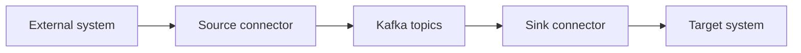

# 3.2 Source and sink connectors

References:

- https://developer.confluent.io/courses/apache-kafka/events/
- https://docs.confluent.io/platform/current/connect/index.html

Kafka Connect integrations are usually described as either source or sink connectors.

## Source connector

A source connector reads from an external system and writes records into Kafka.

Examples:

- database change capture
- files into Kafka
- metrics into Kafka

## Sink connector

A sink connector reads from Kafka and writes to an external system.

Examples:

- Kafka to Elasticsearch
- Kafka to S3
- Kafka to databases

## Data flow

## Operational concerns

- connector configuration management
- schema handling
- error handling and dead-letter topics
- idempotency in downstream systems
- scaling tasks to match partition counts

Prev: [01_kafka_connect_fundamentals.md](01_kafka_connect_fundamentals.md) · Next: [03_hands_on_connect_workflow.md](03_hands_on_connect_workflow.md)
