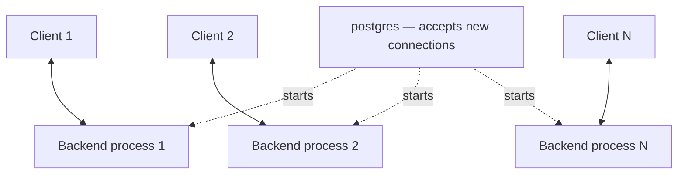

# PostgreSQL Tutorial

https://www.postgresql.org/docs/current/index.html — Official Documentation

**Chapter 2 (SQL language):** [chapter_02_sql/README.md](chapter_02_sql/README.md) — local notes aligned with [Chapter 2. The SQL Language](https://www.postgresql.org/docs/current/tutorial-sql.html).

