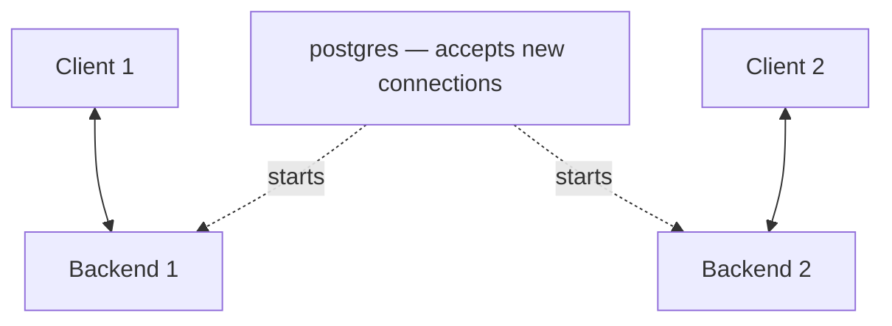

# 1.2 Architectural fundamentals

Official: [1.2. Architectural Fundamentals](https://www.postgresql.org/docs/current/tutorial-arch.html)

PostgreSQL uses a **client/server** model.

| Piece | Role |
|--------|------|
| **Server** | Program **`postgres`**: owns database files, accepts connections, runs SQL for clients. |
| **Client** | Your app or tool: `psql`, a web app, pgAdmin, a script using libpq/JDBC/ODBC, etc. |

Client and server can run on **different hosts** over **TCP/IP**. Files visible on the client are not necessarily on the server (paths differ).

**Many connections:** The main server process accepts connections and starts a **separate backend process** per connection. After that, the client talks to **that** backend. You usually do not see this split; it matters for performance and isolation.

Prev: [01_installation.md](01_installation.md) · Next: [03_creating_database.md](03_creating_database.md)
