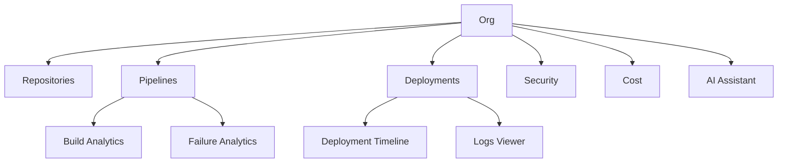
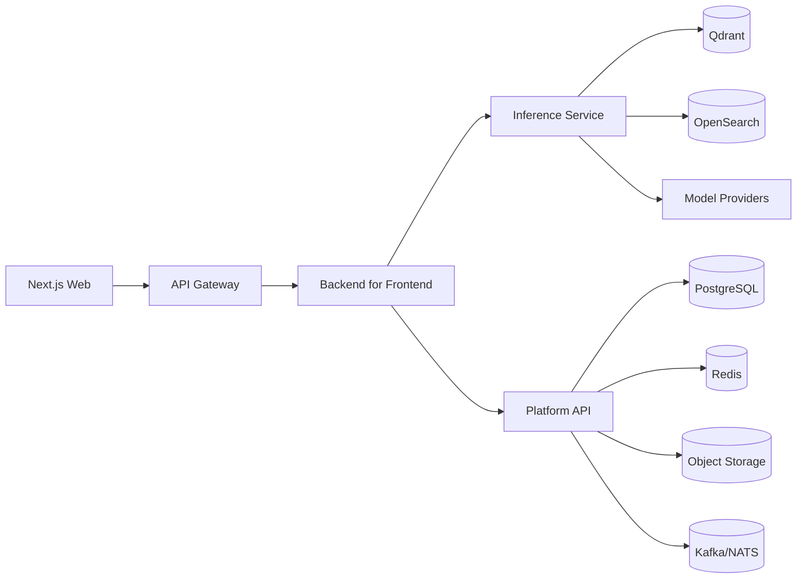

# AI-Native CI/CD Intelligence Platform Blueprint

## 1. Product Requirements Document

Build a commercial SaaS platform that understands CI/CD delivery systems end to end. It should reason over pipelines, logs, metrics, PRs, deployments, security scans, and infrastructure state, then explain what happened, predict what happens next, and generate safe next actions.

Primary outcomes:
- reduce time to diagnose failures
- reduce deployment risk
- improve build reliability and speed
- surface security and cost regressions early
- generate delivery artifacts with approvals and guardrails

Non-goals for v1:
- replace GitHub, Azure DevOps, Kubernetes, or observability tools
- act as a generic chatbot without evidence
- mutate production infra without approval workflows

Success metrics:
- 50% faster diagnosis
- 20% fewer failed deployments
- 40% fewer flaky test incidents
- 15% better first-pass success rate

## 2. User Personas

| Persona | Goal | Pain | AI Value |
|---|---|---|---|
| Platform Engineer | Keep delivery systems healthy | Tool sprawl and noisy signals | Root cause analysis and optimization |
| DevOps Lead | Improve reliability and velocity | Manual triage and inconsistency | Cross-system insights and enforcement |
| SRE | Reduce incident impact | Slow diagnosis | Deployment timelines and summaries |
| Security Engineer | Catch risky changes early | Findings are isolated | AI security review and policy guidance |
| Engineering Manager | Improve throughput | No release health view | KPI rollups and trend summaries |
| Developer | Ship safely and quickly | YAML complexity and flaky tests | Fix guidance and artifact generation |

## 3. User Journeys

1. Open a failing pipeline.
2. The system correlates logs, tests, PRs, and infra changes.
3. The assistant returns a ranked root-cause hypothesis with evidence.
4. The user asks for an optimization plan and a safe rollout recommendation.
5. The system generates artifacts and tracks approvals.

## 4. Information Architecture



Navigation:
Dashboard, Pipeline Explorer, AI Assistant, Deployment Timeline, PR Insights, Repository Overview, Runner Dashboard, Build Analytics, Failure Analytics, Deployment History, Logs Viewer, Kubernetes Explorer, Cost Dashboard, Security Dashboard, AI Chat, Pipeline Generator, Workflow Visualizer, Notification Center, Settings, Organization Management, User Management, Billing.

## 5. UX Wireframes

Dashboard pattern:
- topbar, sidebar, KPI strip, insights, activity

Pipeline Explorer pattern:
- tree view on the left, run detail and logs on the right

AI Assistant pattern:
- context rail, conversational canvas, action rail

Common states:
- skeleton loading
- inline error banner
- empty-state guidance
- retry and fallback actions

## 6. High Fidelity UI

Visual direction:
- dark-first enterprise shell
- linear density, vercel whitespace, datadog metrics, grafana charts
- cyan, teal, and amber accents

| Screen | Wireframe | Component Hierarchy | User Journey | API Mapping | State Management | Loading / Error / Empty States |
|---|---|---|---|---|---|---|
| Dashboard | KPI strip and AI insight feed | Shell > KPIs > charts > insight cards | /chat, /deployment-summary, /optimize | org, filters, time range | skeleton, telemetry error, empty feed |
| Pipeline Explorer | Tree and run detail split view | Tree > detail > logs > evidence | /analyze-pipeline, /root-cause | pipeline, run, stage | tree skeleton, no logs |
| AI Assistant | Context rail plus conversational canvas | Context panel > thread > actions | /chat | thread, evidence bundle | typing, provider fallback, no context |
| Deployment Timeline | Release timeline with risk overlay | Timeline > release cards > risk cards | /deployment-summary, /root-cause | time range, release | skeleton, missing release |
| PR Insights | PR list with diff summary | PR list > diff > AI summary | /chat, /security-review | repo, PR, reviewer | loading, no open PRs |
| Repository Overview | Repo health and activity scorecard | Scorecards > signals > commit feed | /analyze-pipeline, /chat | repo, branch, freshness | empty repo, sync error |
| Runner Dashboard | Fleet utilization and queue view | Fleet > runner detail > queue depth | /optimize | runner pool, region | capacity loading, offline runner |
| Build Analytics | Trend charts and cohorts | Charts > filters > evidence | /analyze-pipeline, /optimize | time range, service | zero data, stale cache |
| Failure Analytics | Failure taxonomy and clusters | Cluster map > top causes > examples | /root-cause, /optimize | failure class, severity | no failures, clustering error |
| Deployment History | Release list and status ribbon | Release list > details > rollback | /deployment-summary, /root-cause | environment, train | history loading, no history |
| Logs Viewer | Log stream with AI highlights | Search > stream > evidence drawer | /chat, /root-cause | log query, source | no matches, query timeout |
| Kubernetes Explorer | Cluster and workload map | Cluster > namespace > workload | /analyze-pipeline, /optimize | cluster, namespace | cluster unavailable, no workloads |
| Cost Dashboard | Spend graph and optimization queue | Spend > anomaly list > recommendations | /optimize | cloud, env, tag | billing lag, no spend data |
| Security Dashboard | Risk score and remediation queue | Findings > policy > remediation | /security-review | policy, severity, repo | scanner offline, zero findings |
| AI Chat | Long-form assistant workspace | Prompt bar > thread > evidence drawer | /chat | thread, memory, tools | idle, provider fallback |
| Pipeline Generator | Spec form and YAML preview | Form > generated YAML > diff | /generate-pipeline, /generate-terraform, /generate-kubernetes | target platform, template | blank form, generation failure |
| Workflow Visualizer | Graph and step inspector | DAG > step detail > annotations | /explain-workflow | workflow graph, selection | graph loading, render failure |
| Notification Center | Unified inbox for alerts and nudges | Inbox > detail > action rail | /chat | channel, severity, read state | empty inbox, sync error |
| Settings | Tenant and preference controls | Tabs > form sections > save bar | admin and metadata APIs | tenant settings, preferences | unsaved changes, validation errors |
| Organization Management | Org hierarchy and quotas | Org tree > memberships > quotas | /chat, admin APIs | org, workspace, policy | empty org, permission denied |
| User Management | Members table and role editor | Table > invite drawer > role panel | admin APIs | user list, role, invite | pending invite, no members |
| Billing | Plan cards and invoices | Plan > usage > invoices | /optimize and billing APIs | plan, seats, usage | invoice loading, payment failure |

## 7. Design System

Foundation tokens:
- background: ink and slate layers
- surfaces: low-contrast panels with crisp borders
- accent: cyan, teal, amber
- typography: modern sans for UI, mono for code/logs
- motion: short transitions and staggered reveals

Core components:
App shell, command palette, sidebar, topbar, KPI cards, charts, evidence cards, diff viewer, YAML editor, log viewer, graph visualizer, empty states, skeletons, alert banners.

## 8. Backend Architecture



Service boundaries:
- API gateway for auth, throttling, and routing
- BFF for UI shaping and aggregation
- inference service for LLM orchestration and RAG
- core service for integrations, tenancy, and metadata
- workers for ingestion, embedding, and analysis

Tradeoffs:
- REST for external compatibility
- gRPC internally for low-latency service calls
- GraphQL only where UI aggregation is expensive
- separate write paths from AI reasoning paths

## 9. AI Inference Architecture

Model strategy:
- GPT: general reasoning, tool use, structured generation
- Claude: long-context analysis and incident synthesis
- Llama: private/self-hosted inference and cost-sensitive workloads
- Qwen: code generation and multilingual support
- DeepSeek: cost-efficient reasoning and coding

Abstraction layer:
- provider interface for chat, embeddings, rerank, and structured outputs
- prompt registry with versioning and rollout controls
- model router by task, context size, latency, cost, and policy
- memory service for tenant-safe summaries
- tool calling for pipelines, logs, deployments, and security
- RAG over docs, logs, PRs, deployment history, and telemetry

Flow:
1. normalize request and attach tenant context
2. fetch relevant evidence
3. choose provider and prompt template
4. generate answer or artifact
5. validate output and policy constraints
6. persist trace and memory artifact

## 10. Database Schema

Core tables: organizations, users, memberships, repositories, pipelines, pipeline_runs, deployment_runs, run_steps, artifacts, logs, metrics_snapshots, pull_requests, security_findings, cost_events, ai_threads, ai_messages, ai_memories, prompt_versions, tool_calls, notifications, audit_events.

## 11. API Specifications

Public inference APIs:
- POST /chat
- POST /analyze-pipeline
- POST /deployment-summary
- POST /root-cause
- POST /optimize
- POST /security-review
- POST /explain-workflow
- POST /generate-pipeline
- POST /generate-terraform
- POST /generate-kubernetes

Example response:
```json
{
  "request_id": "uuid",
  "model": "gpt-5.4-mini",
  "summary": "string",
  "confidence": 0.92,
  "evidence": [],
  "recommendations": [],
  "artifacts": []
}
```

## 12. Event Architecture

Topics:
- pipeline.run.created
- pipeline.run.completed
- deployment.run.created
- deployment.run.completed
- security.scan.completed
- test.results.ingested
- logs.ingested
- ai.insight.generated
- ai.memory.updated
- notification.emitted

Principles:
- idempotent consumers
- correlation IDs everywhere
- schema versioning
- dead-letter queues for failed enrichment

## 13. Infrastructure Architecture

- Next.js web app deployed separately from backend services
- Go services in small containers
- Kubernetes for scaling and isolation
- GPU node pool for self-hosted inference
- Redis for hot state and summaries
- PostgreSQL for durable metadata
- object storage for artifacts and logs
- OpenTelemetry, Prometheus, Grafana, Loki, and Tempo for observability
- Terraform and Helm for reproducible environments
- GitHub Actions for CI/CD and preview environments

## 14. Repository Structure

```text
repo/
├── apps/
│   └── web/
├── services/
│   └── inference/
├── packages/
│   ├── contracts/
│   ├── ui/
│   └── config/
├── infra/
│   ├── terraform/
│   └── helm/
├── docs/
└── product/
    └── ai-cicd-platform/
```

## 15. Development Roadmap

Phase 1: product spec, web shell, inference scaffold, contracts.
Phase 2: user onboarding, organization setup, repository connection, and first-value dashboard.
Phase 3: ingestion, RAG, pipeline explorer, AI assistant, logs, and PR insights.
Phase 4: deployment history, cost, security, generation tools, and production hardening.

## 16. Sprint Plan

Sprint 1: repo structure, frontend shell, inference skeleton, API contracts.
Sprint 2: authentication, tenant model, pipeline explorer, AI chat.
Sprint 3: logs viewer, failure analytics, PR insights, telemetry.
Sprint 4: cost dashboard, security dashboard, billing, readiness hardening.

## 17. Implementation

- build the BFF and inference service first
- share contracts between web and backend
- start with read paths before automated writes
- use feature flags for autonomous actions
- require approvals for destructive changes

## 18. Testing Strategy

- unit tests for provider routing and permission logic
- contract tests for API shapes
- integration tests for ingestion and retrieval
- golden tests for YAML and summaries
- end-to-end tests for dashboard, chat, and generator flows
- load tests for logs and chat traffic
- security tests for prompt injection and tenant isolation

## 19. Deployment Strategy

- deploy web and API separately
- use preview environments for pull requests
- run migrations in release workflows
- canary AI provider changes
- rollback on latency or quality regressions
- maintain DR runbooks for region and provider outages

## 20. Production Readiness Checklist

- auth, RBAC, and tenant isolation
- audit logging for user and AI actions
- tracing and structured logs everywhere
- rate limits and quota enforcement
- backups and restore tests
- monitoring for latency, cost, and errors
- model fallback and provider health checks
- approval workflows for destructive automation
- prompt injection and secret exposure review
- SLOs, runbooks, and on-call ownership
