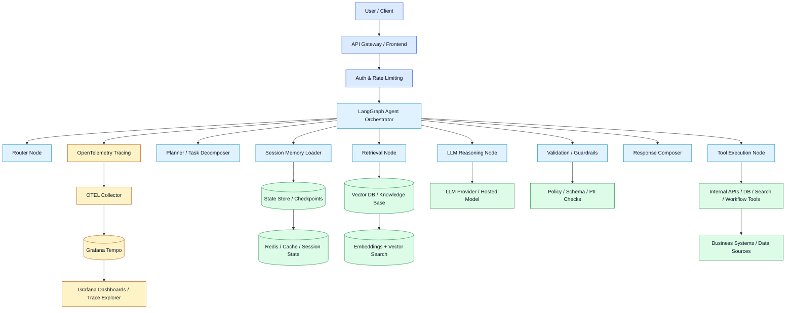

# Production-Ready LangGraph Architecture

This document describes a production-grade LangGraph + LangChain AI agent architecture for a Python application, with OpenTelemetry tracing, Grafana Tempo storage, and Grafana visualisation.

## Mermaid Architecture Diagram



## 1. User Interaction Layer

This layer receives requests from users, apps, or internal clients.

Responsibilities:
- accept incoming requests
- validate auth and tenant identity
- apply rate limiting and request throttling
- pass request metadata to the orchestrator

Security controls:
- OAuth or JWT validation
- per-tenant isolation
- request-size restrictions
- sensitive-data masking before logging

## 2. LangGraph Orchestrator

The LangGraph graph acts as the control plane for the agent. It manages the full workflow and keeps state across each step.

Typical nodes:
- Router Node
- Session Memory Loader
- Planner / Task Decomposer
- Retrieval Node
- Tool Execution Node
- LLM Reasoning Node
- Validation / Guardrails
- Response Composer

Why this matters:
- easier debugging and traceability
- explicit branching and retries
- checkpointing for resilience
- controlled multi-step execution

## 3. Memory and State Layer

A production AI agent needs both short-term and long-term memory.

### Short-term memory
- current chat session
- recent prompt history
- intermediate tool results
- workflow decisions

### Long-term memory
- user profile and preferences
- enterprise context
- historical interactions
- reusable contextual knowledge

Recommended storage:
- Redis for session state and fast cache access
- Postgres or a state backend for durable checkpoints
- vector store for retrieval memory

Best practices:
- keep only necessary context
- avoid raw personal data in trace attributes
- checkpoint key transitions for recovery
- separate active context from archival data

## 4. Retrieval and Knowledge Layer

This layer gives the agent grounded context before or during the reasoning step.

Components:
- vector database
- embedding generation
- metadata indexing
- retrieval logic

Typical workloads:
- semantic search
- knowledge-base lookup
- case retrieval
- policy or document querying

Design advice:
- retrieval should be auditable and traceable
- attach source metadata
- keep retrieval results compact and relevant
- cap documents and tokens to control cost

## 5. Tool Execution Layer

Tools connect the agent to external systems and business logic.

Examples:
- internal APIs
- SQL or NoSQL database queries
- search systems
- workflow automation tools
- CRM, ERP, support, or ticketing integrations

Responsibilities:
- validate arguments before execution
- enforce tool permissions
- catch timeouts and retry failures
- log tool metadata without exposing sensitive payloads
- return structured results to the graph

Important guardrails:
- restrict tool access by role and tenant
- allowlist safe tools only
- do not log full raw responses unless policy permits

## 6. LLM Reasoning Layer

This is where the model reads user input, memory, and retrieved context to decide the next action or final answer.

The reasoning node should:
- build a prompt using relevant context
- include tool instructions only when needed
- call the selected hosted model
- capture metadata such as latency, tokens, status, and retries
- return either a partial result or final answer

Recommended metadata:
- provider name
- model name
- request type
- input/output token counts
- latency
- retry count
- error status

Avoid storing:
- raw prompts unless approved
- full sensitive completions
- high-cardinality session IDs in indexed span attributes

## 7. Validation and Guardrails

The validation layer is mandatory in production AI systems.

Checks can include:
- policy compliance
- schema validation
- prompt-injection detection
- PII filtering
- business logic verification
- output formatting rules

When invalid:
- retry with corrected instructions
- reject the response
- escalate to a human workflow
- record the failure for future improvement

This layer reduces hallucinations and prevents unsafe or noncompliant outputs.

## 8. Response Composer

Once the graph has enough evidence, the response composer formats the final answer.

Responsibilities:
- combine tool output and model response
- apply formatting rules
- include source or citation metadata if required
- ensure final output is safe and complete
- return the result to the client

This stage is also a good place for:
- summary formatting
- metadata tagging
- correlation ID inclusion

## 9. Observability and Tracing

Observability is essential for debugging and operating AI agents at scale.

### Trace flow
The app emits spans for each important step:
- request span
- router span
- retrieval span
- tool call span
- model call span
- validation span
- response span

### Components
- OpenTelemetry SDK in Python
- OTLP exporter
- OpenTelemetry Collector
- Grafana Tempo
- Grafana dashboards and trace explorer

### What to capture
- request latency
- node-level timing
- model provider and version
- token counts
- retries and failures
- tool usage and status

### What to avoid
- raw user prompts
- sensitive document bodies
- full tool payloads
- high-cardinality IDs in indexed attributes

This matches the pattern already used by the repo: LangChain spans are exported via OTLP to the collector, then stored in Tempo and visualized in Grafana.

## 10. Security Controls

A production AI agent needs explicit controls in every layer.

Key controls:
- authentication and authorization
- tenant isolation
- least-privilege tool access
- secret management
- controlled logging and redaction
- prompt-injection detection
- PII detection and masking
- rate limiting and audit logging

Security design principle:
- the LLM should never access secrets directly
- tool routing must be controlled and policy-checked
- traces should carry only safe metadata

## 11. Production Scaling Considerations

### Horizontal scaling
- run multiple agent workers behind a load balancer
- keep state externalized and shared
- scale stateless application nodes independently from data stores

### Retry and resilience
- add timeouts for model calls and tool calls
- handle partial failures gracefully
- use circuit breakers and bounded retries
- persist checkpoints so work can resume

### Sampling and cost control
- keep a small baseline sample of healthy requests
- always retain errors and slow requests
- reduce expensive trace volume by dropping raw payloads
- monitor token usage and tool churn

### Retention
- keep recent traces searchable
- archive older traces to object storage when required
- align retention with compliance and incident requirements

### Cost optimization
- limit context windows
- prefer smaller models for simple tasks
- cache safe repeated requests
- bound retries and fallback loops
- route tasks to the right model complexity

## 12. Recommended Request Flow

```text
User -> API -> Auth -> Router -> Memory Load -> Retrieval -> Planner -> Tool Execution -> LLM -> Validation -> Response Composer -> Return Result
```

And the observability flow is:

```text
App Spans -> OpenTelemetry Collector -> Grafana Tempo -> Grafana Dashboards
```

## 13. AI-Agent Prompt Template

Use this prompt to generate or refine the system with another AI agent:

> Design a production-ready LangGraph architecture for a Python-based AI agent system using LangChain, OpenTelemetry tracing, Grafana Tempo, and Grafana. Include the workflow nodes, memory and state handling, tool execution, retrieval layer, LLM reasoning, validation and guardrails, observability, security controls, and production scaling considerations. Show the result as a Mermaid diagram and explain each component in detail.

## 14. Suggested Next Steps

- define the actual agent nodes for your use case
- add tool definitions and state schema
- define memory strategy for sessions and user context
- add tracing attributes for tool, model, and latency metadata
- create Grafana dashboards for request rate, error rate, and model latency
- add policy checks for PII, safety, and schema validation
