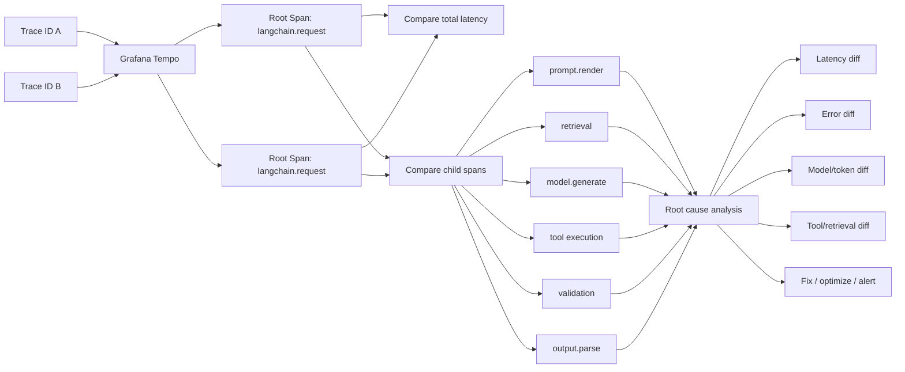
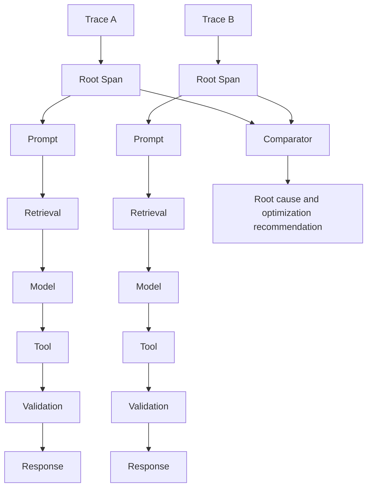

# Trace ID Comparison Architecture

This document explains how to compare two trace IDs in a LangChain / LangGraph system instrumented with OpenTelemetry, Grafana Tempo, and Grafana.

## Mermaid Architecture Diagram



## 1. Why compare traces

Comparing two trace IDs helps answer:
- Why was one request slower than another?
- Which node introduced the delay?
- Did the model call differ?
- Did a tool or retrieval step fail?
- Was there a retry, timeout, or validation issue?

This is useful when debugging slow requests, flaky workflows, model regressions, or tool failures.

## 2. Trace comparison flow

```text
Request 1 -> Trace ID A -> Grafana Tempo
Request 2 -> Trace ID B -> Grafana Tempo
          -> Compare root and child spans
          -> Identify latency and failure differences
          -> Find root cause
```

## 3. Comparison workflow

### Step 1: Capture both trace IDs

When the app runs, it prints a trace ID in the terminal, for example:

```text
trace_id=1f2a7d9b0f2d4b5c9a3e7f2b8d4a1a2c
```

Keep both IDs from two runs or two requests.

### Step 2: Open both in Grafana

In Grafana Tempo:
- paste trace ID A
- open the trace
- then paste trace ID B
- compare the waterfall and span tree side by side

### Step 3: Compare root span

Check the root span named `langchain.request`.

Look for:
- total duration
- status code or error
- whether the request timed out
- whether one trace had retries or fallback logic

### Step 4: Compare child spans

Check the child spans for each request:
- `prompt.render`
- `retrieval`
- `model.generate`
- `tool execution`
- `validation`
- `output.parse`

The first slow span usually points to the root cause.

### Step 5: Inspect the metadata

Compare attributes such as:
- provider name
- model name
- token usage
- retry count
- tool name
- retrieval count
- latency in milliseconds

### Step 6: Determine the issue

Use this decision guide:

- If `model.generate` is slow -> model or provider latency
- If `tool execution` is slow -> external dependency or timeout issue
- If `retrieval` is slow -> vector DB or knowledge retrieval issue
- If validation failed -> guardrail, schema, or output issue
- If `output.parse` is slow -> parsing or formatting problem

## 4. Checklist for debugging two trace IDs

Use this checklist for both traces:

- same request type?
- same user or tenant?
- same model provider?
- same tool path?
- same retrieval context?
- any error status in one trace and not the other?
- different latency distribution?
- token difference large or unexpected?
- retries or fallback in one trace only?

## 5. Trace comparison architecture



## 6. Grafana / Tempo comparison plan

This is the recommended plan for comparison in your setup:

1. Run two requests with similar input or one changed variable
2. Save both trace IDs
3. Open both traces in Grafana Tempo
4. Compare root span duration and child span timing
5. Check model/tool/retrieval metadata and errors
6. Identify the first slowest span
7. Decide the issue and apply the fix

## 7. Recommended TraceQL filter

Use TraceQL in Grafana to narrow the view:

```text
{ resource.service.name = "langchain-tutorial" }
```

Then manually compare the two retrieved trace IDs in the same time range.

## 8. Practical example

If Trace A takes 2.5s and Trace B takes 0.7s, compare the waterfall:

- If `model.generate` is 2.1s in Trace A and 0.2s in Trace B, the model path is the issue.
- If `retrieval` is 1.8s in Trace A, investigate vector or DB latency.
- If `tool execution` is slow only in one trace, inspect the external call and timeout config.
- If validation fails only in one trace, inspect policy or output rules.

## 9. Best practice

Always compare traces under similar conditions:
- same environment
- same request type
- same tenant or user context
- same time window

This keeps the comparison meaningful.

## 10. Suggested next step

Create a separate trace comparison dashboard in Grafana with panels for:
- request duration
- model latency
- tool latency
- retrieval latency
- error rate
- retries per request

This gives you a production-ready comparison workflow for debugging requests quickly.
